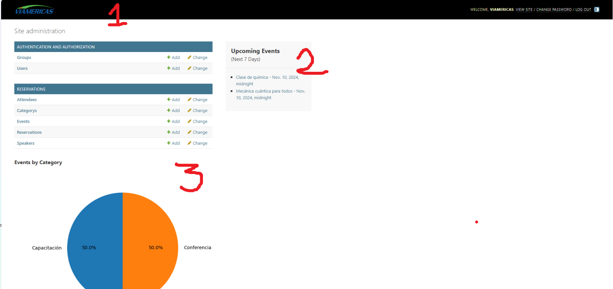
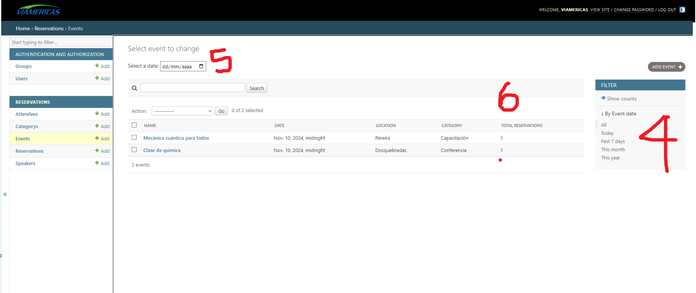
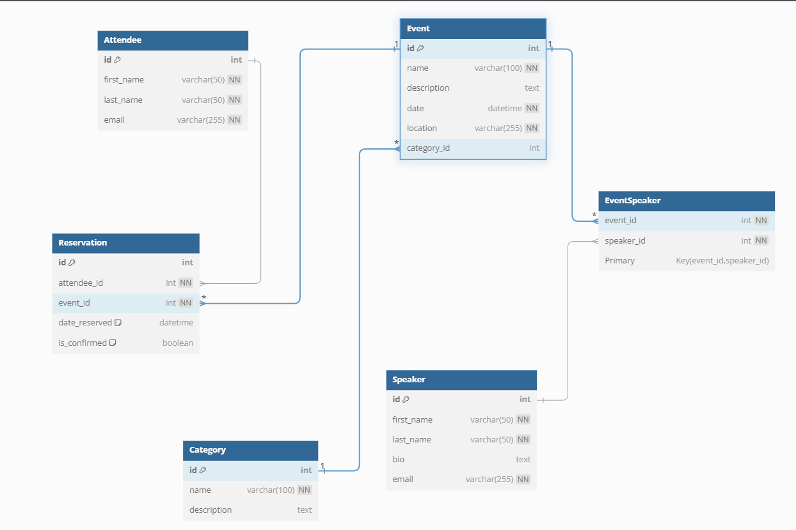

# Data por defecto

Para poblar la información en la base de datos creé un archivo `seed.py` el cual se corre en la fase de construcción del docker compose por medio del comando personalizado `python manage.py populate`. Aqui se crearán dos usuarios con diferentes niveles de permisos

| username        | password          |
| --------------- | ----------------- |
| viamericas      | holamundo123      |
| restricted_user | restrictedpass123 |

esto es útil para evidenciar el manejo de permisos en el panel administrativo de django.

Adicionalmente se crearon datos para el resto de modelos, ya que la API solo fue creada para gestionar Event y Reservation.

# Uso de la api

Los endpoints de la api están descritos en la siguiente sección de postman. Sin embargo cabe resaltar el orden lógico de los nieveles de permisos de cada uno de los usuarios descritos en el apartado anterior

| username        | access level                                     |
| --------------- | ------------------------------------------------ |
| viamericas      | fullaccess                                       |
| restricted_user | view_reservation, change_reservation, view_event |

Por lo cual una prueba interesante es intentar eliminar algún registro con el usuario `restricted_user` obteniendo un 403. Para ello nos logueamos en el endpoint `api-token-auth/` y con el test configurado en postman automaticamente almacenará el token en la variable {{token}} y esta será usada en los endpoints subyacentes.

# Link para documentación con postman

- https://www.postman.com/dark-space-466960/viamericas/documentation/f0faznp/viamericas
  
# Personalizaciones para en panel administrativo

Adjuntaré algunos pantallazos para hacer mas facil la explicación

1. Modificación de estilos para la barra superior
2. Recuadro con eventos que se llevarán a cabo la proxima semana
3. PieChart con la información de número de eventos por categoría
4. Filtro avanzado por periodos de tiempo
5. Filtro avanzado incrustado en la plantilla de filtro por fecha específica en el calendario
6. Campo calculado adicional de total de reservas de cada evento
7. Se agregaron dos acciones nuevas en Event: Convertir nombres a mayúsculas y Capitalizar nombres

# Test

Creé solamente el test para el viewSet del modelo Event. Para ejecutarlo:

1. Activar el virtualenv con todo instalado
2. Pararse en el directorio viamericas (allí está el pytest.ini)
3. Ejecutar `pytest`
4. Disfrutar

# Export de archivo xlsx

Para probar esta característica recomiendo utilizar el navegador web, no encontré como hacer que postamn procesara la respuesta para descargar el archivo. El queryparam puede ser event o category

- http://localhost:8000/report?model=event

# Correr localmente

1. `docker build -t jhonsanz/viamericas .`
2. `docker run -it --rm -p 8000:8000 jhonsanz/viamericas`
3. disfrutar

# Despliegue en AWS

1. Tener instalado `aws cli`
2. Tener configurado `aws config`
3. Entrar al directorio `/iac`
4. Activar el entorno virtual `.venv\Scripts\activate` o `.venv/bin/activate`
5. Ejecutar `pip install -r requirements.txt`
6. Ejectuar `cdk bootstrap`
7. Opcional `cdk synth` para ver la plantilla de cloud formation
8. Ejectuar `cdk deploy` para desplegar el contenido
9. Disfrutar
10. Recomendado `cdk destroy` para eliminar el stack

Como puede verse en el archivo `iac/iac_stack.py` la imagen de docker fue previamente subida a un repositorio y no se hizo ese step en el archivo de AWS CDK.

### 👇🚨🚨⚠️⚠️ IMPORTANTE ⚠️⚠️🚨🚨👇

> Este stack creará todos los recursos en AWS. Es importante recalcar que solamnete se creará el loadbalancer así que utilizaremos su DNS como URL para acceder a los servicios. Entonces, hay que buscar el balanceador en EC2 y copiar el DNS en postman o el software preferido para hacer peticiones.

# Diagrama de base de datos

